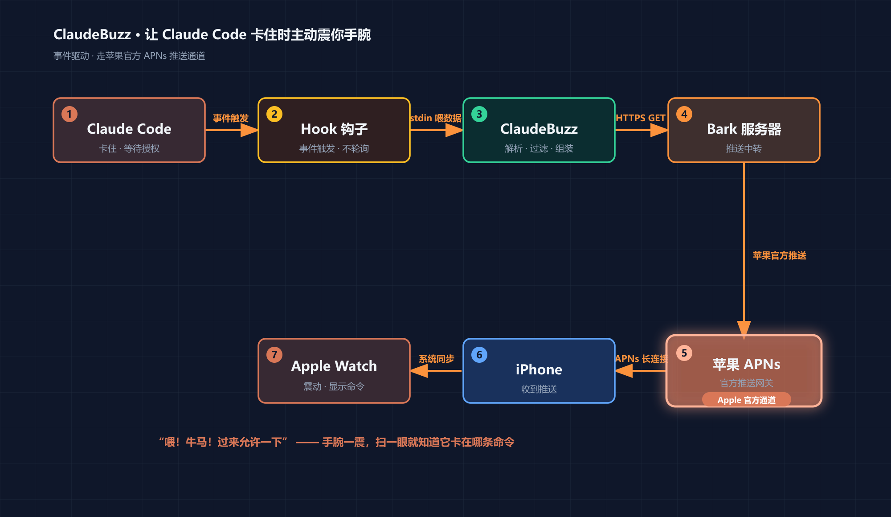

# ClaudeBuzz 🤖⌚

> Claude Code 卡住等你授权时，主动把通知推到你的**手机 / Apple Watch**——零配置 Claude Code 插件，走苹果官方推送。

你是不是也遇到过：给 Claude Code 派了个活儿，转头去刷手机/倒水/开会，回过神来发现它**早就卡在 `Do you want to proceed?` 等你点「允许」**，白白浪费十几分钟？

ClaudeBuzz 让它在需要你的那一刻**主动震你手腕**，还告诉你它卡在哪条命令上。



## ✨ 特点

- **零配置安装**：作为 Claude Code 插件分发，`/plugin install` 后 hook 自动注册，**无需手动改 `settings.json`**。
- **只在该打扰时打扰**：默认**只在需要你授权时**推送，任务进度、普通事件一律静默。
- **带真实命令详情**：通知正文直接显示它要执行的命令（`Bash: git push…` / `rm -rf…`），扫一眼就知道该不该放行。
- **危险命令升级推送**：检测到 `rm -rf` / `git push --force` / `drop table` 等高危操作，自动升级为 `critical`（突破勿扰/静音）+ 重复响铃 + 🚨 专属图标，危险操作绝不漏。
- **分事件铃声**：等授权 / 任务完成 / 危险 各用不同提示音（Bark `sound`），一耳朵分清是哪类事件。
- **一键复制命令**：命令类通知长按即可复制它要执行的完整命令（Bark `copy`），不必回终端手敲。
- **主打 iPhone / Apple Watch**：走 [Bark](https://github.com/Finb/Bark) → 苹果官方 APNs → 手腕直接震，体验最稳最顺。（安卓也能用，但不是主场景，见下文「安卓」一节。）
- **话术可换**：内置 11 种语气——`coolie`(牛马) / `cute`(可爱) / `boss`(总裁) / `emperor`(皇上) / `palace`(甄嬛) / `gentle`(温柔) / `zen`(佛系) / `military`(军令) / `mom`(老妈) / `en`(English) / `off`，一条命令切换。
- **图标可换**：内置预设 `robot-pink`(默认) / `robot-gray` / `claude` / `bell`，也可填任意图片 URL。
- **通知类型可配**：`permission`(默认开) / `done` / `attention` / `danger` / `failure`，按需开关。
- **跨平台 · 零依赖**：纯 Node.js 内置模块，Windows / macOS / Linux 通吃，原生 UTF-8，无 GBK 乱码坑。

## 🚀 安装（两条命令）

```text
/plugin marketplace add hjxccc/claudebuzz
/plugin install claudebuzz
```

然后在 Claude Code 里运行配置向导：

```text
/notify-setup
```

它会引导你：粘贴 Bark key → 发测试推送 → 选话术。**搞定后新会话即生效**——Claude Code 一卡住等授权，手腕立刻震。

> 需要先在手机装 [Bark](https://apps.apple.com/app/bark/id1403753865)（免费开源，iOS）并复制首页的推送地址。

## 🔧 手动配置（可选）

不想用 `/notify-setup` 也可以直接用自带 CLI：

```bash
node bin/claudebuzz.js config bark "https://api.day.app/你的KEY/"   # iPhone / Apple Watch（主推）
node bin/claudebuzz.js config feishu "https://open.feishu.cn/...hook/xxx"  # 安卓兜底（飞书机器人）
node bin/claudebuzz.js test           # 发测试推送
node bin/claudebuzz.js persona cute   # 切换话术（11 种）
node bin/claudebuzz.js icon claude    # 切换图标
node bin/claudebuzz.js notify done on # 开启“任务完成”通知
node bin/claudebuzz.js doctor         # 健康检查
```

## ⚙️ 配置文件

`~/.claude/claudebuzz/config.json`：

```json
{
  "channels": [
    { "type": "bark", "key": "", "server": "https://api.day.app",
      "icon": "https://cdn.jsdelivr.net/gh/hjxccc/agentwatch-assets@main/claude_robot_pink.png",
      "group": "ClaudeCode", "level": "timeSensitive" }
  ],
  "notify": { "onPermission": true, "onTaskDone": false, "onAttention": false, "onDanger": false },
  "persona": "coolie",
  "detailMaxLen": 45,
  "dedupWindowMs": 8000
}
```

想顺带收「任务完成」提醒，把 `notify.onTaskDone` 改成 `true` 即可。

### 🚨 危险命令升级 & 分事件铃声（iPhone 专属）

`config.json` 里两块可调：

```json
{
  "sounds": { "permission_required": "shake", "task_done": "birdsong", "danger": "alarm" },
  "danger": { "level": "critical", "call": true, "icon": "danger" }
}
```

- **危险升级**：命令文本命中 `rm -rf` / `sudo` / `git push` / `git reset --hard` / `chmod` 等高危词，自动套用 `danger` 配置——`level=critical` 突破勿扰静音、`call=true` 重复响铃、`icon=danger` 换成 🚨。即使是「请求允许执行 rm -rf」这类授权事件也会被升级。
- **分事件铃声**：`sounds` 按事件类型给不同 Bark 铃声，留空则用内置默认。铃声名见 [Bark 文档](https://github.com/Finb/Bark)。

> 想让 `critical` 真正突破静音，需在 iPhone「设置 → 通知 → Bark」开启**关键警报/时效性通知**权限。`快速体验：node bin/claudebuzz.js test danger`。

### 📱 安卓说明（不是主场景，按需自取）

**ClaudeBuzz 主打 iPhone / Apple Watch**——Bark 走苹果官方 APNs，到手腕又快又稳。安卓我们也认真试过独立推送 App（如 ntfy），但**国产 ROM（vivo / 小米 / OPPO / 华为）会激进杀后台，经常漏收**（实测消息确实推到了服务器、`curl` 能拿到，是手机端被系统杀进程拦下了）。所以安卓**只保留一条稳的兜底路：飞书 webhook**——飞书作为办公 IM 长期常驻、不被杀，消息基本必达。代价是推到的是飞书消息而非系统级通知。

#### 实在要安卓：飞书 webhook 兜底

```bash
# 飞书建群 → 群设置 → 群机器人 → 添加自定义机器人 → 复制 Webhook 地址
node bin/claudebuzz.js config feishu "https://open.feishu.cn/open-apis/bot/v2/hook/xxxx"
# 若机器人开了「签名校验」，再带上 secret：
node bin/claudebuzz.js config feishu "https://open.feishu.cn/.../hook/xxxx" "你的secret"
node bin/claudebuzz.js test
```

> 安全设置选「自定义关键词」（如 `ClaudeBuzz`）最省事，不用管 secret。

一句话：**iPhone 用户开箱即用、体验最佳；安卓用户用飞书 webhook 兜底，别期待 iOS 级别的丝滑。**

## 🗺️ 路线图

- **v1（当前）**：Claude Code 插件，主打 Bark(iOS / Apple Watch)；安卓兜底 飞书 webhook（另含 PushDeer 可选）；按需推送 + 命令详情 + persona + 去重。
- **v2**：更多渠道（Telegram / 企业微信 / Server酱）；**手机一键 allow/deny 远程批准**（PreToolUse 决定 + 本地中继）；自建 Bark 服务器引导。

## 🙏 致谢

灵感与早期实现思路来自开源项目 [AgentWatch](https://github.com/dongxutang918-afk/agentwatch)；推送链路依赖 [Bark](https://github.com/Finb/Bark)。ClaudeBuzz 在其基础上做成了零配置插件，并内置了命令详情提取、按需推送、persona、去重等改进。

## 📄 License

MIT
